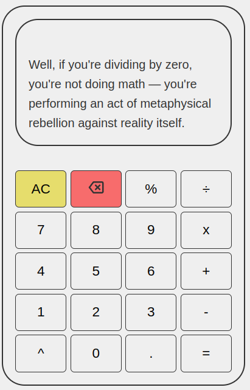

# Calculator

Calculator 🧮

An intuitive browser-based calculator built with JavaScript, HTML & CSS

Built with ❤️ during The Odin Project Foundations

📤 Deployment

Live Preview: https://mp-v99.github.io/Calculator/

🚀 Introduction

This project marks the finale of The Odin Project’s Foundations course. It combines everything I've learned so far about JavaScript, from functions and DOM manipulation to event handling and state management. The goal was to build a fully functioning, interactive calculator interface that mimics the behavior of a physical calculator—plus a few extra features for good measure.

✨ Features
Basic arithmetic operations: add, subtract, multiply, divide

Chained calculations using result memory (e.g. 3 + 4 → = → + 5)

Decimal support with input validation

Snarky error handling (including division by zero)

Clear button to reset the calculator state

Backspace functionality to delete last digit

Display overflow prevention with rounding

Full keyboard support for a seamless user experience

💎 Extra Credit
✅ Support for floating point input via . button

✅ Decimal validation (only one decimal per number)

✅ Backspace button for undoing inputs

✅ Full keyboard support for digits, operators, equals, clear, and backspace

✅ Smart state reset when starting a new calculation after displaying a result

✅ Defensive logic for edge cases like consecutive operators or premature = presses

🧪 Tech Used

HTML – semantic layout

CSS3 – responsive and clean styling

JavaScript – all logic and interaction

Git – version control

GitHub – deployment & commits

## 📸 Screenshots

